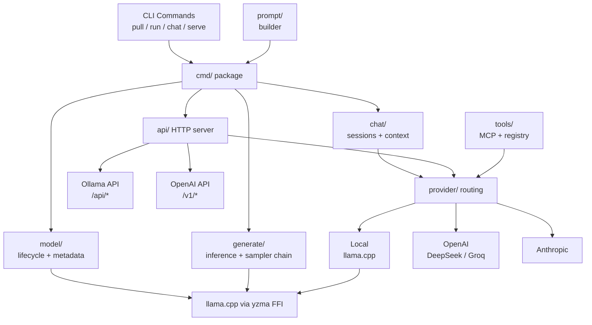
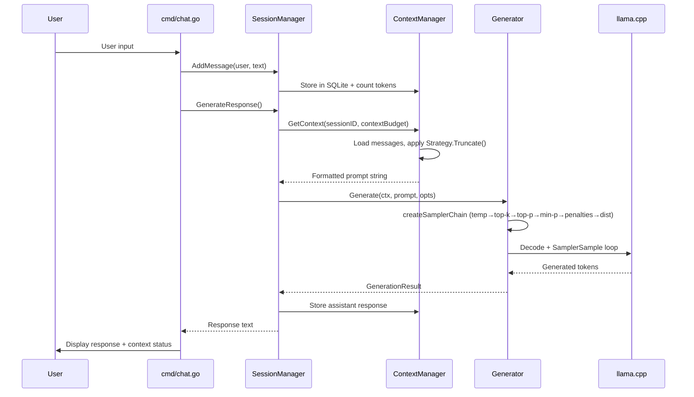
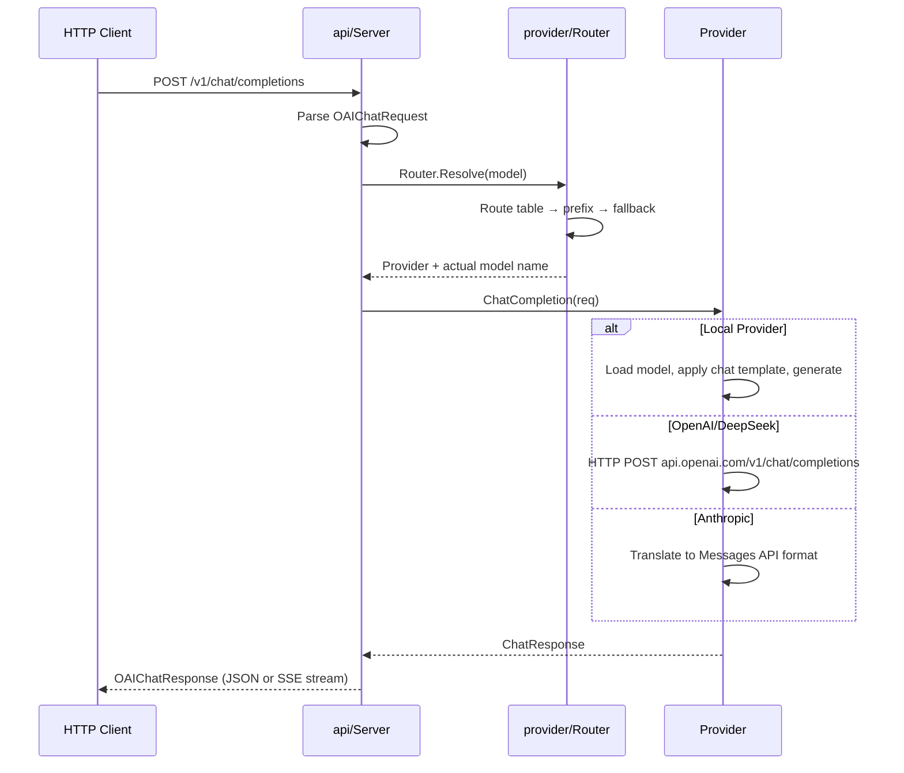

# Architecture

## System Overview

## Package Map

### `cmd/` -- CLI Commands

Entry point: `main.go` -> `cmd.Execute()` (Cobra).

| File | Command | Description |
|------|---------|-------------|
| `root.go` | (root) | Global flags (`--model`, `--temperature`, `--verbose`), config loading |
| `pull.go` | `guff pull` | Download models from HuggingFace with progress reporting |
| `run.go` | `guff run` | Single-prompt generation, supports `--stream` and stdin |
| `chat.go` | `guff chat` | Interactive chat with SQLite persistence, context management, `/status` command |
| `serve.go` | `guff serve` | HTTP API server with provider router setup |

### `internal/model/` -- Model Lifecycle

- **`ModelManager`** -- Singleton with `sync.Mutex`. One active model at a time.
- **`Load(name, opts)`** -- Loads a GGUF model via yzma. Returns `LoadedModel` with `Ctx`, `Vocab`, `Model` handles.
- **`Unload()`** -- Frees model resources.
- **`ScanModels()`** -- Discovers `.gguf` files in model directories.
- **`LoadOptions`** -- `NumGpuLayers` (default 35), `UseMmap` (default true), `UseMlock` (default false).
- Lazy initialization of llama.cpp backend via `sync.Once`.

### `internal/generate/` -- Text Generation

- **`Generator`** -- Wraps a `LoadedModel` for inference.
- **`Generate(ctx, prompt, opts)`** -- Blocking generation, returns `GenerationResult`.
- **`GenerateStream(ctx, prompt, opts)`** -- Returns `chan StreamChunk` (buffered 32 tokens).
- **`createSamplerChain(opts)`** -- Builds the llama.cpp sampler chain. See [Sampling](sampling.md).
- **`GenerationOptions`** -- Temperature, TopP, TopK, MinP, MaxTokens, Stop, Seed, RepeatPenalty, FrequencyPenalty, PresencePenalty, Grammar, Stream.

### `internal/chat/` -- Chat System

Three-layer architecture:

**`session/`** -- `SessionManager`
- Creates, loads, lists sessions
- Computes context budget: `contextSize - maxGenTokens`
- Delegates to `ContextManager` for token tracking
- `SetContextSize(n)` -- set from model metadata

**`context/`** -- `ContextManager` + `ContextStrategy`
- Pluggable strategy interface (see [Context Management](context-management.md))
- Real token counting via `Tokenizer` (yzma vocabulary-based)
- Tracks `ContextStatus` per session (message count, tokens, truncation state)
- Default strategy: `SlidingWindowStrategy`

**`storage/`** -- `Storage` interface + `SQLiteStorage`
- Sessions table: ID, model, title, message count, token count, timestamps
- Messages table: ID, session ID, role, content, token count, timestamp
- `ListSessions()`, `GetMessages()`, `AddMessage()`, `DeleteMessage()`

### `internal/provider/` -- Provider Routing

See [Providers](providers.md) for full details.

- **`Provider`** interface -- `ChatCompletion()`, `ChatCompletionStream()`, `ListModels()`
- **`Router`** -- Resolution: explicit routes -> prefix syntax -> fallback
- **Implementations**: `LocalProvider`, `OpenAIProvider` (also DeepSeek, any compatible), `AnthropicProvider`

### `internal/tools/` -- Tool Registry + MCP

See [MCP & Tools](mcp-tools.md) for full details.

- **`Registry`** -- Register tools with definitions + handlers, execute calls
- **`MCPClient`** -- stdio JSON-RPC 2.0 client for MCP servers
- **`ParseToolCall()`** -- Extract tool calls from local model text output

### `internal/prompt/` -- Prompt Builder

See [Prompt Builder](prompt-builder.md) for full details.

- **`Builder`** -- Assembles multi-part system prompts from sections
- Section types: `base`, `project`, `tools`, `user`
- Auto-discovery: `.guff/prompt.md` (walks up from CWD), `~/.config/guff/user-prompt.txt`

### `internal/api/` -- HTTP Server

Chi-based router with middleware (request ID, logging, recovery, timeout).

| Route Group | Endpoint | Handler |
|-------------|----------|---------|
| Ollama | `GET /api/tags` | `handleListModels` |
| Ollama | `POST /api/generate` | `handleGenerate` (streaming + non-streaming) |
| Ollama | `POST /api/chat` | `handleChat` (streaming + non-streaming) |
| Ollama | `POST /api/pull` | `handlePullModel` (TODO) |
| OpenAI | `POST /v1/chat/completions` | `handleV1ChatCompletions` |
| OpenAI | `POST /v1/completions` | `handleV1Completions` |
| OpenAI | `GET /v1/models` | `handleV1Models` |
| Health | `GET /` | Server identification |
| Health | `GET /health` | JSON health check |

### `internal/config/` -- Configuration

See [Configuration](configuration.md) for full reference.

Viper-based with YAML, XDG directories, `GUFF_` env prefix.

### `internal/llama/` -- Library Management

`EnsureLibraries()` auto-downloads the correct llama.cpp build:
- Detects CUDA via `nvidia-smi`
- Uses Metal on macOS ARM64
- Falls back to CPU if no GPU detected

## Data Flow: Chat Request

## Data Flow: API Request (OpenAI-compatible)

## Thread Safety

- `ModelManager` -- `sync.Mutex` (one model at a time)
- `provider.Router` -- `sync.RWMutex` (concurrent reads, exclusive writes)
- `tools.Registry` -- `sync.RWMutex`
- `DefaultContextManager` -- `sync.RWMutex` on strategy map
- `MCPClient` -- `sync.Mutex` on stdio read/write
