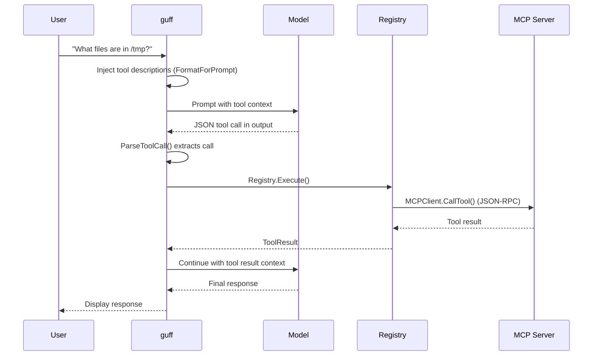

# MCP & Tool Integration

guff supports the [Model Context Protocol (MCP)](https://modelcontextprotocol.io/) for connecting LLMs to external tools and data sources.

## Overview

The tool system has three components:

1. **Tool Registry** (`internal/tools/registry.go`) -- Central registry of tool definitions and handlers
2. **MCP Client** (`internal/tools/mcp.go`) -- Connects to MCP servers over stdio (JSON-RPC 2.0)
3. **Tool Call Parser** (`internal/tools/parser.go`) -- Extracts tool calls from local model text output

## MCP Server Configuration

Configure MCP servers in `~/.config/guff/config.yaml`:

```yaml
mcp:
  filesystem:
    command: npx
    args: ["-y", "@anthropic/mcp-filesystem", "/home/user/projects"]
  github:
    command: npx
    args: ["-y", "@modelcontextprotocol/server-github"]
    env:
      GITHUB_TOKEN: ${GITHUB_TOKEN}
  sqlite:
    command: npx
    args: ["-y", "@anthropic/mcp-sqlite", "/path/to/database.db"]
```

Each MCP server entry specifies:

| Field | Required | Description |
|-------|----------|-------------|
| `command` | Yes | Executable to run |
| `args` | No | Command-line arguments |
| `env` | No | Environment variables (supports `${VAR}` expansion) |

## How It Works

### Startup

1. guff launches each configured MCP server as a child process
2. Sends `initialize` JSON-RPC handshake (protocol version `2024-11-05`)
3. Sends `notifications/initialized` notification
4. Calls `tools/list` to discover available tools
5. Registers each tool in the `Registry` with a handler that proxies to `tools/call`

### Tool Execution Flow



### For Local Models

Local models don't have native function calling. guff bridges this gap:

1. **Prompt injection**: Tool descriptions are formatted into the system prompt via `Registry.FormatForPrompt()`:
   ```
   You have access to the following tools:

   ### filesystem_list
   List files in a directory
   Parameters: {"type":"object","properties":{"path":{"type":"string"}}}

   To use a tool, respond with a JSON block:
   ```json
   {"tool": "tool_name", "arguments": {"arg": "value"}}
   ```
   ```

2. **Output parsing**: `ParseToolCall()` scans model output for tool call JSON, supporting:
   - Markdown code blocks: `` ```json\n{"tool": "name", ...}\n``` ``
   - Raw JSON: `{"tool": "name", ...}`

### For Remote Providers

Remote providers (OpenAI, Anthropic) with native function calling can use the `Tools` field in `ChatRequest` directly. The `ToolDef` format is compatible with OpenAI's function calling schema.

## Tool Registry API

### Registering a Tool

```go
registry := tools.NewRegistry()

registry.Register(tools.ToolDef{
    Name:        "search",
    Description: "Search the web for information",
    Parameters:  json.RawMessage(`{
        "type": "object",
        "properties": {
            "query": {"type": "string", "description": "Search query"}
        },
        "required": ["query"]
    }`),
}, func(ctx context.Context, args json.RawMessage) (string, error) {
    var input struct {
        Query string `json:"query"`
    }
    json.Unmarshal(args, &input)
    // ... perform search ...
    return results, nil
})
```

### Executing a Tool Call

```go
result := registry.Execute(ctx, tools.ToolCall{
    ID:        "call_123",
    Name:      "search",
    Arguments: json.RawMessage(`{"query": "golang concurrency"}`),
})
// result.Content contains the output
// result.IsError indicates failure
```

### Listing Tools

```go
defs := registry.List()  // returns []ToolDef in registration order
```

### Generating Prompt Text

```go
promptText := registry.FormatForPrompt()
// Inject into system prompt for local models
```

## MCP Client API

### Direct Usage

```go
client, err := tools.NewMCPClient(ctx, tools.MCPServerConfig{
    Name:    "myserver",
    Command: "npx",
    Args:    []string{"-y", "my-mcp-server"},
})
defer client.Close()

// List available tools
defs, err := client.ListTools(ctx)

// Call a tool
result, err := client.CallTool(ctx, "tool_name", json.RawMessage(`{"arg": "value"}`))
```

### Auto-Registration

```go
// Connects to MCP server and registers all its tools in the registry
client, err := tools.RegisterMCPTools(ctx, registry, config)
defer client.Close()
```

## MCP Protocol Details

guff implements the MCP stdio transport:

- **Transport**: stdin/stdout of child process
- **Protocol**: JSON-RPC 2.0 (one JSON object per line)
- **Version**: `2024-11-05`
- **Capabilities**: `initialize`, `notifications/initialized`, `tools/list`, `tools/call`

Each request gets a unique incrementing ID. Responses are matched by ID. Notifications (no ID field) are fire-and-forget.

## Naming Convention

Guff-native tools follow the `{namespace}_{verb}` naming convention derived from Go interface methods. See [Naming Conventions](naming-conventions.md) for the full rules.

```
# Guff-native tools — follow the convention
memory_store, memory_search, session_list, context_status

# External MCP tools — keep upstream names
filesystem_list, filesystem_read, github_create_issue
```

External tools from third-party MCP servers keep whatever names their servers define. The convention applies only to tools that project guff's own Go interfaces.

The `internal/adapter/` package provides `Wrap[A, R]()` and `WrapVoid[A]()` generics to create type-safe MCP tool handlers from Go functions. `RegisterAll()` batch-registers them into the existing `tools.Registry`.

## Current Limitations

- **Stdio only** -- no HTTP/WebSocket MCP transport yet
- **No resource support** -- only tools are discovered (not prompts or resources)
- **Sequential calls** -- tool calls are executed one at a time (no parallel tool use)
- **Local model parsing** -- depends on model producing well-formed JSON; may need grammar constraints for reliability
