# Memory & Context Management Deep-Dive

> Memory isn't a feature. It's the difference between a chatbot and an agent.
>
> guff treats memory as a first-class, MCP-accessible capability. Models don't just *have* memory -- they *use* it. They store insights, search for context, recall past conversations, and forget on command. All through the same MCP tool interface that powers file access and GitHub integration.

---

## The Big Picture

Four layers, each building on the last:

```mermaid
graph TB
    subgraph "Layer 4: MCP Memory Interface"
        MT[memory_store] --> MP
        MS[memory_search] --> MP
        MR[memory_recall] --> MP
        MF[memory_forget] --> MP
        MP[Memory MCP Server]
    end

    subgraph "Layer 3: Memory Plugin"
        MP --> MI[MemoryProvider Interface]
        MI --> T1[Tier 1: SQLite Text]
        MI --> T2[Tier 2: SQLite + Vectors]
        MI --> T3[Tier 3: PostgreSQL + pgvector]
    end

    subgraph "Layer 2: Context Management"
        CM[ContextManager] --> CS[ContextStrategy]
        CS --> SW[Sliding Window]
        CS --> FL[Fail]
        CS --> SU[Summarization]
        CS --> HY[Hybrid]
    end

    subgraph "Layer 1: Storage"
        ST[Storage Interface] --> SQ[SQLiteStorage]
        SQ --> DB[(chat.db)]
    end

    MI --> ST
    CM --> ST

    style T1 fill:#2d5a2d,stroke:#4a4a4a
    style SW fill:#2d5a2d,stroke:#4a4a4a
    style FL fill:#2d5a2d,stroke:#4a4a4a
    style SQ fill:#2d5a2d,stroke:#4a4a4a
    style T2 fill:#5a5a2d,stroke:#4a4a4a
    style T3 fill:#5a2d2d,stroke:#4a4a4a
    style SU fill:#5a5a2d,stroke:#4a4a4a
    style HY fill:#5a5a2d,stroke:#4a4a4a
    style MP fill:#2d2d5a,stroke:#4a4a4a
```



**Green** = implemented. **Yellow** = next step. **Red** = production vision. **Blue** = the key innovation.

The critical insight: **Layer 4 is the primary interface**. The model talks to its own memory through MCP tool calls. It decides what to remember. It decides what to search for. The memory system isn't a dumb store -- it's an active participant in every conversation.

---

## Layer 1: Storage (Implemented)

The foundation. Every message, every session, every KV-cache snapshot lands in SQLite.

### Schema

Three tables, zero configuration:

```sql
CREATE TABLE IF NOT EXISTS sessions (
    id TEXT PRIMARY KEY,
    user_id TEXT,
    model_name TEXT NOT NULL,
    title TEXT,
    created_at TIMESTAMP NOT NULL,
    updated_at TIMESTAMP NOT NULL,
    message_count INTEGER NOT NULL DEFAULT 0,
    total_tokens INTEGER NOT NULL DEFAULT 0
);

CREATE TABLE IF NOT EXISTS messages (
    id TEXT PRIMARY KEY,
    session_id TEXT NOT NULL,
    role TEXT NOT NULL,
    content TEXT NOT NULL,
    tool_calls TEXT,
    created_at TIMESTAMP NOT NULL,
    token_count INTEGER,
    FOREIGN KEY (session_id) REFERENCES sessions(id) ON DELETE CASCADE
);

CREATE TABLE IF NOT EXISTS state_files (
    id TEXT PRIMARY KEY,
    session_id TEXT NOT NULL,
    path TEXT NOT NULL,
    created_at TIMESTAMP NOT NULL,
    token_count INTEGER NOT NULL,
    FOREIGN KEY (session_id) REFERENCES sessions(id) ON DELETE CASCADE
);
```

Indexes on `session_id`, `created_at`, `user_id`, and `updated_at` keep queries fast as history grows.

### The Storage Interface

Every storage backend implements this contract (`internal/chat/storage/storage.go`):

```go
type Storage interface {
    // Session operations
    CreateSession(ctx context.Context, session *Session) error
    GetSession(ctx context.Context, id string) (*Session, error)
    UpdateSession(ctx context.Context, session *Session) error
    DeleteSession(ctx context.Context, id string) error
    ListSessions(ctx context.Context, userID string, limit, offset int) ([]*Session, error)

    // Message operations
    AddMessage(ctx context.Context, message *Message) error
    GetMessage(ctx context.Context, id string) (*Message, error)
    GetMessages(ctx context.Context, sessionID string, limit, offset int) ([]*Message, error)
    UpdateMessage(ctx context.Context, message *Message) error
    DeleteMessage(ctx context.Context, id string) error
    DeleteMessages(ctx context.Context, sessionID string) error
    CountMessages(ctx context.Context, sessionID string) (int, error)

    // State file operations
    AddStateFile(ctx context.Context, state *StateFile) error
    GetStateFile(ctx context.Context, id string) (*StateFile, error)
    GetStateFiles(ctx context.Context, sessionID string) ([]*StateFile, error)
    DeleteStateFile(ctx context.Context, id string) error
    DeleteStateFiles(ctx context.Context, sessionID string) error

    // Maintenance
    Close() error
    CleanupOldStateFiles(ctx context.Context, olderThan time.Time) error
}
```

### Data Structures

```go
type Message struct {
    ID         string      `json:"id"`
    SessionID  string      `json:"session_id"`
    Role       MessageRole `json:"role"`         // "system", "user", "assistant", "tool"
    Content    string      `json:"content"`
    ToolCalls  []ToolCall  `json:"tool_calls,omitempty"`
    CreatedAt  time.Time   `json:"created_at"`
    TokenCount int         `json:"token_count,omitempty"`
}

type Session struct {
    ID           string    `json:"id"`
    UserID       string    `json:"user_id,omitempty"`
    ModelName    string    `json:"model_name"`
    Title        string    `json:"title,omitempty"`
    CreatedAt    time.Time `json:"created_at"`
    UpdatedAt    time.Time `json:"updated_at"`
    MessageCount int       `json:"message_count"`
    TotalTokens  int       `json:"total_tokens"`
}

type StateFile struct {
    ID         string    `json:"id"`
    SessionID  string    `json:"session_id"`
    Path       string    `json:"path"`
    CreatedAt  time.Time `json:"created_at"`
    TokenCount int       `json:"token_count"`
}
```

### Where It Lives

```
~/.local/share/guff/
  chat.db               # SQLite database (sessions + messages)
  state/                # KV-cache state files
    {sessionID}_seq{seqID}_{timestamp}.state
```

Single file. Zero infrastructure. Back it up with `cp`. Inspect it with `sqlite3`. Production-ready for single-user deployments.

---

## Layer 2: Context Management (Implemented)

The context manager sits between storage and the model. It decides what the model actually sees -- which messages make the cut, which get dropped, and how token budgets are enforced.

### The ContextManager Interface

```go
type ContextManager interface {
    AddMessage(ctx context.Context, sessionID, role, content string) (tokenCount int, err error)
    GetContext(ctx context.Context, sessionID string, maxTokens int) (formatted string, err error)
    ClearContext(ctx context.Context, sessionID string) error
    TokenCount(ctx context.Context, sessionID string) (int, error)
    SetStrategy(ctx context.Context, sessionID string, strategy ContextStrategy) error
    GetStatus(ctx context.Context, sessionID string) (*ContextStatus, error)
}
```

### The Strategy Plugin Interface

Context strategies are pluggable. Implement `ContextStrategy` and you control how overflow is handled:

```go
type ContextStrategy interface {
    Name() string
    Truncate(ctx context.Context, store storage.Storage, sessionID string,
        messages []*storage.Message, tokenBudget int) ([]*storage.Message, error)
}
```

Two parameters drive the decision: the full message list and the token budget. The strategy returns whichever messages survive.

### Token Budget Calculation

The budget is computed in `SessionManager.GenerateResponse()`:

```
contextBudget = contextSize - maxGenTokens
```

Clamped to a minimum of 256 tokens so the model always has *something* to work with. With a 2048-token context and 512 max generation tokens, you get 1536 tokens for conversation history.

### Sliding Window Strategy (Implemented)

The default. Keeps the newest messages that fit within budget. System messages are always preserved.

**Algorithm:**

1. Separate system messages from non-system messages
2. Reserve token budget for system messages first
3. Walk backwards through non-system messages, accumulating token counts
4. Stop when adding the next message would exceed the remaining budget
5. Delete discarded messages from storage
6. Return system messages + kept non-system messages

```go
func (s *SlidingWindowStrategy) Truncate(ctx context.Context, store storage.Storage,
    sessionID string, messages []*storage.Message, tokenBudget int) ([]*storage.Message, error) {
    // Separate system messages
    var systemMsgs, nonSystemMsgs []*storage.Message
    systemTokens := 0
    for _, msg := range messages {
        if msg.Role == storage.RoleSystem {
            systemMsgs = append(systemMsgs, msg)
            systemTokens += msg.TokenCount
        } else {
            nonSystemMsgs = append(nonSystemMsgs, msg)
        }
    }

    remaining := tokenBudget - systemTokens

    // Walk backwards, keeping newest that fit
    keepFrom := len(nonSystemMsgs)
    used := 0
    for i := len(nonSystemMsgs) - 1; i >= 0; i-- {
        used += nonSystemMsgs[i].TokenCount
        if used > remaining {
            keepFrom = i + 1
            break
        }
    }

    // Delete discarded messages from storage
    for i := 0; i < keepFrom; i++ {
        store.DeleteMessage(ctx, nonSystemMsgs[i].ID)
    }

    // System messages first, then kept non-system messages
    result := append(systemMsgs, nonSystemMsgs[keepFrom:]...)
    return result, nil
}
```

The sliding window is destructive -- dropped messages are deleted from the database. This keeps the database lean but means old messages are gone. Future strategies (summarization, hybrid) will preserve them differently.

### Fail Strategy (Implemented)

No truncation. Returns `ErrContextTooLong` when the context exceeds the budget. Useful for testing or when losing messages is unacceptable.

```go
func (s *FailStrategy) Truncate(_ context.Context, _ storage.Storage, _ string,
    _ []*storage.Message, _ int) ([]*storage.Message, error) {
    return nil, ErrContextTooLong
}
```

### Context Status Tracking

Every `GetContext` call updates status tracking. The status is exposed to the user via `/status` in chat and the compact status line after each turn:

```go
type ContextStatus struct {
    MessageCount int    // messages in the session
    TotalTokens  int    // total tokens across all messages
    TokenBudget  int    // max tokens allowed for context
    StrategyName string // "sliding_window" or "fail"
    Truncated    bool   // whether truncation happened on last GetContext
}
```

Display: `[12 msgs | 847/2048 tokens | sliding_window]`

### Tokenizer Interface

```go
type Tokenizer interface {
    CountTokens(text string) int
}
```

Two implementations:
- **YzmaTokenizer**: Uses the loaded model's actual tokenizer for exact counts
- **SimpleTokenizer**: Estimates at ~4 characters per token (fallback when no model is loaded)

The exact tokenizer matters. Off-by-one on token counts means either wasted context or unexpected truncation.

> **See also:** [Context Management](context-management.md) covers configuration, CLI flags, and usage patterns.

---

## Layer 3: The Memory Plugin Architecture (Design Vision)

This is where memory stops being "chat history" and becomes a genuine capability. The `MemoryProvider` interface defines a pluggable memory backend that tiers from zero-config SQLite to production-scale PostgreSQL with vector search.

### The MemoryProvider Interface (Proposed)

```go
// MemoryProvider defines the plugin contract for memory backends.
type MemoryProvider interface {
    // Store saves a memory with metadata and optional embedding.
    Store(ctx context.Context, memory *Memory) error

    // Search finds memories by semantic similarity.
    // Returns results ranked by relevance score.
    Search(ctx context.Context, query string, opts SearchOptions) ([]*MemoryResult, error)

    // Recall retrieves conversation history for a specific session.
    Recall(ctx context.Context, sessionID string, opts RecallOptions) ([]*Memory, error)

    // Forget deletes memories matching the given criteria.
    Forget(ctx context.Context, criteria ForgetCriteria) (int, error)

    // Close releases resources.
    Close() error
}

type Memory struct {
    ID        string            `json:"id"`
    SessionID string            `json:"session_id,omitempty"`
    Content   string            `json:"content"`
    Role      string            `json:"role,omitempty"`
    Tags      []string          `json:"tags,omitempty"`
    Metadata  map[string]string `json:"metadata,omitempty"`
    Embedding []float32         `json:"embedding,omitempty"`
    CreatedAt time.Time         `json:"created_at"`
    Score     float64           `json:"score,omitempty"` // relevance score from search
}

type SearchOptions struct {
    Limit     int               `json:"limit"`
    MinScore  float64           `json:"min_score,omitempty"`
    Tags      []string          `json:"tags,omitempty"`
    SessionID string            `json:"session_id,omitempty"`
    Since     *time.Time        `json:"since,omitempty"`
}

type RecallOptions struct {
    Limit  int  `json:"limit"`
    Offset int  `json:"offset"`
}

type ForgetCriteria struct {
    IDs       []string   `json:"ids,omitempty"`
    SessionID string     `json:"session_id,omitempty"`
    Tags      []string   `json:"tags,omitempty"`
    Before    *time.Time `json:"before,omitempty"`
}
```

Three tiers implement this interface. Each tier adds capabilities while preserving backward compatibility.

### Tier 1: SQLite Text (Current Default)

**Status: Implemented** (as the existing `Storage` interface)

Reframe what we already have as the first memory tier:

- Session recall via `GetMessages()` -- full conversation history
- Basic text matching via SQL `LIKE` queries
- Zero infrastructure -- single `chat.db` file at `~/.local/share/guff/`
- Automatic on first run, no configuration needed

**What it gives you:** Persistent sessions, message history, token tracking, KV-cache state files. Everything in the current `internal/chat/storage/` package.

**What it doesn't:** Semantic search. "Remember when we discussed X?" requires exact text matching, not conceptual understanding.

### Tier 2: SQLite + Vector Embeddings (Next Step)

**Status: Design vision**

Add semantic search to SQLite using the [sqlite-vec](https://github.com/asg017/sqlite-vec) extension. Every message gets stored as both text and an embedding vector. Same single file, same zero infrastructure.

**How it works:**

1. On `AddMessage()`, compute the embedding vector using the loaded model's `Embed()` method (already implemented in `internal/generate/`)
2. Store the text in the existing `messages` table
3. Store the embedding in a new `message_embeddings` virtual table
4. On `Search()`, embed the query and run a vector similarity search against stored embeddings
5. Return results ranked by cosine similarity

**Schema addition:**

```sql
-- sqlite-vec virtual table for vector search
CREATE VIRTUAL TABLE IF NOT EXISTS message_embeddings USING vec0(
    message_id TEXT PRIMARY KEY,
    embedding FLOAT[384]  -- dimension depends on model
);
```

**Dual-write flow:**

```
User message arrives
  → Tokenize (count tokens)
  → Embed (generate vector)
  → INSERT INTO messages (text + metadata)
  → INSERT INTO message_embeddings (vector)
```

**Search flow:**

```
"Remember when we discussed database indexing?"
  → Embed the query string
  → SELECT from message_embeddings ORDER BY distance(embedding, query_vec)
  → JOIN with messages table for full content
  → Return top-K results with relevance scores
```

**Configuration:**

```yaml
memory:
  provider: sqlite-vec
  embedding_model: granite-3b    # model used for embedding generation
  embedding_dim: 384             # vector dimension (model-dependent)
  auto_embed: true               # embed every message automatically
  search_limit: 10               # default search result limit
  min_score: 0.7                 # minimum cosine similarity threshold
```

**Why this tier matters:** Semantic search with zero infrastructure. No Redis. No PostgreSQL. No Docker. The model asks "what did the user say about authentication?" and gets semantically relevant results from a single SQLite file.

### Tier 3: PostgreSQL + pgvector + Redis (Production Scale)

**Status: Design vision**

For multi-user, multi-instance deployments where a single SQLite file isn't enough.

**Components:**

| Component | Role |
|-----------|------|
| **PostgreSQL** | Shared persistent storage, full-text search (`tsvector`), ACID transactions |
| **pgvector** | Vector similarity search at scale, IVFFlat/HNSW indexes |
| **Redis** | Hot context cache, session state, pub/sub for multi-instance sync |

**What it enables:**

- **Multi-user isolation**: Each user's memories are fully isolated via `user_id`
- **Cross-session search**: "What have I discussed about Go concurrency across all my sessions?"
- **Time-decay relevance**: Recent memories score higher than old ones
- **Memory consolidation**: An LLM periodically summarizes clusters of old memories into compressed summaries, reducing storage while preserving knowledge
- **Horizontal scaling**: Multiple guff instances share state through PostgreSQL + Redis pub/sub
- **Full-text + vector hybrid**: Combine keyword search (`tsvector`) with semantic search (`pgvector`) for best-of-both retrieval

**Schema (PostgreSQL):**

```sql
CREATE TABLE memories (
    id UUID PRIMARY KEY DEFAULT gen_random_uuid(),
    user_id TEXT NOT NULL,
    session_id TEXT,
    content TEXT NOT NULL,
    role TEXT,
    tags TEXT[],
    metadata JSONB DEFAULT '{}',
    embedding vector(384),
    created_at TIMESTAMPTZ NOT NULL DEFAULT NOW(),
    search_vector tsvector GENERATED ALWAYS AS (to_tsvector('english', content)) STORED
);

CREATE INDEX idx_memories_embedding ON memories USING hnsw (embedding vector_cosine_ops);
CREATE INDEX idx_memories_search ON memories USING gin (search_vector);
CREATE INDEX idx_memories_user ON memories (user_id);
CREATE INDEX idx_memories_session ON memories (session_id);
CREATE INDEX idx_memories_tags ON memories USING gin (tags);
```

**Configuration:**

```yaml
memory:
  provider: postgresql
  postgresql:
    host: localhost
    port: 5432
    database: guff
    user: guff
    password: ${GUFF_DB_PASSWORD}
    sslmode: prefer
  redis:
    addr: localhost:6379
    password: ${GUFF_REDIS_PASSWORD}
    db: 0
    cache_ttl: 30m              # hot context cache duration
  embedding_model: granite-3b
  consolidation:
    enabled: true
    interval: 24h               # how often to consolidate old memories
    age_threshold: 7d           # memories older than this get consolidated
    summarization_model: granite-3b
  time_decay:
    enabled: true
    half_life: 30d              # memories lose half their relevance every 30 days
```

**Time-decay scoring:**

```
relevance = cosine_similarity * decay_factor
decay_factor = 0.5 ^ (age_days / half_life_days)
```

A memory from yesterday with 0.85 similarity scores higher than a memory from 60 days ago with 0.90 similarity. Recent context matters more.

**Memory consolidation flow:**

```
Every 24h:
  → Find memory clusters older than 7 days (via embedding similarity)
  → Group related memories
  → Summarize each group with the LLM: "Summarize these 15 messages about database design"
  → Store the summary as a new consolidated memory
  → Archive (don't delete) the originals
```

This keeps the active memory set small and searchable while preserving full history.

---

## Layer 4: MCP Memory Interface (The Key Innovation)

This is what makes guff's memory architecture different from every other LLM runtime. **Memory is an MCP server.** The model accesses its own memory through the same tool-calling interface it uses for file access, GitHub, and databases.

### Naming Convention

The four memory MCP tools follow guff's naming convention: Go interface methods project to `{namespace}_{verb}` snake_case names. `MemoryProvider.Store()` becomes `memory_store`, `MemoryProvider.Search()` becomes `memory_search`, and so on. The `internal/adapter/` package provides generic type-safe bridging from Go functions to MCP tool handlers. See [Naming Conventions](naming-conventions.md) for the full projection rules.

### Why MCP-First

Most LLM runtimes bolt memory onto the system prompt. Fixed context, fixed history, no model agency. The model doesn't choose what to remember -- the runtime does. The model doesn't search its memory -- the runtime injects whatever it thinks is relevant.

guff inverts this:

- **The model decides what to remember.** It calls `memory_store` when it encounters something worth saving.
- **The model decides what to recall.** It calls `memory_search` when it needs context beyond the current window.
- **Any MCP client gets memory.** Not just guff -- Claude Desktop, Zed, VS Code with MCP support, anything.
- **Backends are swappable.** Switch from SQLite to PostgreSQL without touching the model or prompt.
- **Composable.** Chain memory tools with filesystem tools, database tools, or any other MCP server.

### Memory MCP Tool Definitions

Following the existing `ToolDef` format from `internal/tools/registry.go`:

#### `memory_store`

Save a memory with tags and metadata.

```json
{
  "name": "memory_store",
  "description": "Store a memory for future recall. Use this to save important facts, user preferences, decisions, or any information that should persist across conversations. Include relevant tags for searchability.",
  "parameters": {
    "type": "object",
    "properties": {
      "content": {
        "type": "string",
        "description": "The content to remember. Be specific and self-contained -- this will be retrieved out of context."
      },
      "tags": {
        "type": "array",
        "items": {"type": "string"},
        "description": "Tags for categorization and filtering (e.g., 'preference', 'decision', 'fact', 'code-pattern')."
      },
      "metadata": {
        "type": "object",
        "additionalProperties": {"type": "string"},
        "description": "Optional key-value metadata (e.g., {'project': 'guff', 'topic': 'auth'})."
      }
    },
    "required": ["content"]
  }
}
```

#### `memory_search`

Semantic search across all stored memories.

```json
{
  "name": "memory_search",
  "description": "Search stored memories by semantic similarity. Use this when you need to recall previously stored information, find relevant context from past conversations, or check if you already know something about a topic.",
  "parameters": {
    "type": "object",
    "properties": {
      "query": {
        "type": "string",
        "description": "Natural language search query. Describe what you're looking for conceptually, not keyword matching."
      },
      "limit": {
        "type": "integer",
        "default": 5,
        "description": "Maximum number of results to return."
      },
      "tags": {
        "type": "array",
        "items": {"type": "string"},
        "description": "Filter results to memories with these tags."
      },
      "min_score": {
        "type": "number",
        "default": 0.7,
        "description": "Minimum relevance score (0.0 to 1.0)."
      }
    },
    "required": ["query"]
  }
}
```

#### `memory_recall`

Retrieve conversation history for a specific session.

```json
{
  "name": "memory_recall",
  "description": "Recall conversation history from a specific session or the current session. Use this to review what was discussed previously, especially after context truncation.",
  "parameters": {
    "type": "object",
    "properties": {
      "session_id": {
        "type": "string",
        "description": "Session ID to recall. Omit to use the current session."
      },
      "limit": {
        "type": "integer",
        "default": 20,
        "description": "Maximum number of messages to retrieve."
      },
      "offset": {
        "type": "integer",
        "default": 0,
        "description": "Number of messages to skip (for pagination)."
      }
    }
  }
}
```

#### `memory_forget`

Delete memories. Essential for user privacy and GDPR compliance.

```json
{
  "name": "memory_forget",
  "description": "Delete stored memories. Use this when the user asks you to forget something, when information is outdated, or for privacy reasons. This is permanent and cannot be undone.",
  "parameters": {
    "type": "object",
    "properties": {
      "ids": {
        "type": "array",
        "items": {"type": "string"},
        "description": "Specific memory IDs to delete."
      },
      "tags": {
        "type": "array",
        "items": {"type": "string"},
        "description": "Delete all memories with these tags."
      },
      "session_id": {
        "type": "string",
        "description": "Delete all memories from this session."
      },
      "before": {
        "type": "string",
        "format": "date-time",
        "description": "Delete all memories created before this timestamp."
      }
    }
  }
}
```

### Configuration

The memory MCP server follows the existing `MCPServerConfig` format:

```yaml
# ~/.config/guff/config.yaml
mcp:
  # Memory server (built-in, launched automatically)
  memory:
    command: guff
    args: ["memory-server"]
    env:
      GUFF_MEMORY_PROVIDER: sqlite-vec     # or "sqlite", "postgresql"
      GUFF_MEMORY_DB: ~/.local/share/guff/memory.db

  # Other MCP servers
  filesystem:
    command: npx
    args: ["-y", "@anthropic/mcp-filesystem", "/home/user/projects"]
```

The `guff memory-server` command launches a standalone MCP server that exposes the four memory tools. It runs as a subprocess, communicates via stdio JSON-RPC 2.0, and connects to whichever `MemoryProvider` tier is configured.

### The Flow

```
User: "What authentication approach did we decide on last week?"

1. Model receives the question
2. Model recognizes it needs past context
3. Model calls memory_search:
   {"query": "authentication approach decision", "tags": ["decision"]}
4. Memory MCP server:
   → Embeds the query string
   → Searches vector index for similar memories
   → Returns top results with scores:
     [
       {"content": "Decided to use JWT with refresh tokens...",
        "score": 0.92, "created_at": "2026-02-25T..."},
       {"content": "Considered OAuth but ruled it out because...",
        "score": 0.87, "created_at": "2026-02-25T..."}
     ]
5. Model incorporates the retrieved memories into its response
6. Model answers with full context from a conversation that may have
   been truncated from the active window long ago
```

```
User: "Remember that I prefer snake_case for database columns."

1. Model receives the instruction
2. Model calls memory_store:
   {"content": "User prefers snake_case for database column naming conventions",
    "tags": ["preference", "database", "naming"]}
3. Memory MCP server stores the memory with embedding
4. Model confirms: "Got it. I'll use snake_case for database columns going forward."

--- Three weeks later, different session ---

User: "Design a schema for a user table."

1. Model calls memory_search:
   {"query": "database naming conventions preferences"}
2. Memory returns the snake_case preference
3. Model generates the schema with snake_case columns
```

The model has agency over its own memory. It's not a search engine -- it's a cognitive tool.

---

## Context Strategies: Current + Planned

The `ContextStrategy` interface allows new strategies to be added without touching the context manager. Here's the full roadmap:

### Sliding Window (Implemented)

Keep the newest messages, drop the oldest. System messages are always preserved.

- **Best for:** General chat, coding assistance, quick Q&A
- **Trade-off:** Old context is permanently lost
- **Default:** Yes

### Fail (Implemented)

Error on overflow. No truncation.

- **Best for:** Testing, debugging, scenarios requiring guaranteed full context
- **Trade-off:** Conversation stops when budget is exceeded

### Summarization (Design Vision)

When context overflows, compress old messages into a summary instead of deleting them.

```
Original: 50 messages, 3000 tokens
After: 1 summary message (200 tokens) + 20 recent messages (1200 tokens)
```

**How it would work:**

1. When `totalTokens > budget`, select the oldest N messages for summarization
2. Send them to the LLM: "Summarize this conversation so far in 2-3 paragraphs"
3. Replace the N messages with a single system message containing the summary
4. Keep the most recent messages verbatim

**Trade-off:** Requires an LLM call during context management. Adds latency but preserves semantic content.

### Hybrid (Design Vision)

Recent messages verbatim + summary of older ones + vector-retrieved relevant messages.

```
[System prompt]
[Summary of messages 1-40]
[Messages 41-50 verbatim]
[3 vector-retrieved relevant messages from history]
[Current message]
```

**Best for:** Long-running sessions where both recent context and historical relevance matter.

### RAG-Enhanced (Design Vision)

On every user message, run a vector search against all past messages and inject the most relevant ones into context, regardless of recency.

**Flow:**
1. User sends message
2. Embed the message
3. Search message history for semantically similar past exchanges
4. Inject top-K results into context alongside recent messages
5. Generate response with both recent and relevant historical context

### Adaptive (Design Vision)

Auto-selects strategy based on conversation patterns:

- Short conversations (< 20 messages): no truncation needed
- Medium conversations: sliding window
- Long technical sessions: hybrid (summary + recent)
- Multi-session workflows: RAG-enhanced with cross-session search

---

## KV-Cache State Persistence (Implemented)

The KV-cache is the model's "working memory" -- the computed attention states for all processed tokens. Saving and restoring it means resuming a conversation without re-processing the entire history.

### The StateManager Interface

```go
type StateManager interface {
    // Save the current KV-cache state for the given session and sequence.
    SaveState(ctx context.Context, sessionID string, ctxLLama llama.Context,
        seqID llama.SeqId, tokens []llama.Token) (string, error)

    // Load a previously saved state into the context.
    LoadState(ctx context.Context, sessionID string, ctxLLama llama.Context,
        seqID llama.SeqId) ([]llama.Token, error)

    // Delete all state files associated with a session.
    CleanupSession(ctx context.Context, sessionID string) error
}
```

### How It Works

**Save:** `llama.StateSeqSaveFile()` dumps the KV-cache to disk as a binary file. The token sequence is stored alongside it so we know exactly what state corresponds to what conversation.

**Load:** `llama.StateSeqLoadFile()` restores the KV-cache from disk. The model picks up exactly where it left off -- no re-tokenization, no re-computation of attention.

**File naming:** `{sessionID}_seq{seqID}_{timestamp}.state`

**Storage tracking:** State files are recorded in the `state_files` table so they can be cleaned up, listed, and associated with sessions.

### Why It Matters

Without KV-cache persistence, resuming a 2000-token conversation requires the model to re-process all 2000 tokens before generating the next response. With state persistence, it loads the binary state file and starts generating immediately.

For long conversations and low-latency applications, this is the difference between a 5-second delay and instant response.

---

## Putting It All Together

The complete flow from user message to model response, across all four layers:

```
User types: "What's the best way to handle database migrations?"

1. TOKENIZE
   → SimpleTokenizer or YzmaTokenizer counts tokens
   → TokenCount = 9

2. STORE (Layer 1)
   → INSERT INTO messages (id, session_id, role='user', content, token_count=9)
   → UPDATE sessions SET message_count++, total_tokens+=9

3. CONTEXT BUILD (Layer 2)
   → contextBudget = contextSize - maxGenTokens  (e.g., 2048 - 512 = 1536)
   → Fetch all messages for session
   → If totalTokens > budget:
     → strategy.Truncate() — sliding window keeps newest
   → Format messages into prompt string

4. MEMORY QUERY (Layer 4, future)
   → Model sees the prompt, decides to search memory
   → Calls memory_search: {"query": "database migration patterns"}
   → Memory MCP server returns relevant past memories
   → Results injected as tool results in the conversation

5. GENERATE
   → Prompt → sampler chain (12 stages) → tokens
   → Assistant response generated

6. STORE RESPONSE (Layer 1)
   → INSERT assistant message with token count
   → Model optionally calls memory_store for important insights
```

### Feature Matrix by Tier

| Feature | Tier 1 (SQLite) | Tier 2 (sqlite-vec) | Tier 3 (PostgreSQL) |
|---------|:-:|:-:|:-:|
| Session persistence | **Implemented** | **Implemented** | **Implemented** |
| Message history | **Implemented** | **Implemented** | **Implemented** |
| Token counting | **Implemented** | **Implemented** | **Implemented** |
| KV-cache state files | **Implemented** | **Implemented** | **Implemented** |
| Sliding window | **Implemented** | **Implemented** | **Implemented** |
| Fail strategy | **Implemented** | **Implemented** | **Implemented** |
| Text search (LIKE) | **Implemented** | **Implemented** | **Implemented** |
| Semantic vector search | -- | Vision | Vision |
| Auto-embed on message | -- | Vision | Vision |
| Full-text search (tsvector) | -- | -- | Vision |
| Multi-user isolation | -- | -- | Vision |
| Cross-session search | -- | Vision | Vision |
| Time-decay relevance | -- | -- | Vision |
| Memory consolidation | -- | -- | Vision |
| Multi-instance sync | -- | -- | Vision |
| Summarization strategy | -- | Vision | Vision |
| MCP memory tools | -- | Vision | Vision |
| GDPR forget | -- | Vision | Vision |

### What's Implemented vs. What's Vision

**Implemented today:**
- SQLite storage with sessions, messages, and state files
- Sliding window and fail context strategies
- Token counting with exact (yzma) and approximate (simple) tokenizers
- KV-cache state persistence and restoration
- Context status tracking and display
- Embeddings generation (via `Generator.Embed()` and remote providers)

**Design vision:**
- `MemoryProvider` plugin interface
- sqlite-vec integration for local vector search
- PostgreSQL + pgvector + Redis for production scale
- MCP memory server with store/search/recall/forget tools
- Summarization, hybrid, RAG-enhanced, and adaptive context strategies
- Memory consolidation and time-decay relevance scoring

The architecture is designed so each tier builds on the last. Tier 2 adds a virtual table to the existing SQLite database. Tier 3 replaces the storage backend but keeps the same `MemoryProvider` interface. The MCP tools work identically regardless of which tier is active.

---

> **Related docs:**
> [Context Management](context-management.md) -- configuration and usage patterns.
> [MCP & Tools](mcp-tools.md) -- MCP server setup, tool registry, function calling.
> [Sampling](sampling.md) -- the 12-stage sampler chain.
> [Architecture](architecture.md) -- full system design and package structure.
