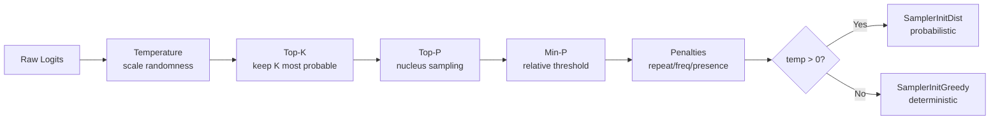

# Sampling

guff uses llama.cpp's sampler chain system (via yzma) to control text generation. The chain order is critical -- filters must come before the terminal sampler.

## Sampler Chain

The chain is built in `internal/generate/generate.go:createSamplerChain()`:



**Order matters.** Each sampler filters or transforms the token probability distribution, and the terminal sampler makes the final selection. Putting the terminal sampler anywhere except last produces incorrect results.

## Parameters

### Temperature

Controls randomness. Applied first to scale logits before other filters.

| Value | Behavior |
|-------|----------|
| 0.0 | Deterministic (uses greedy terminal sampler) |
| 0.1-0.5 | Low randomness, focused output |
| 0.7-0.9 | Moderate randomness (recommended for chat) |
| 1.0 | Standard randomness |
| 1.5+ | High randomness, creative/chaotic |

**Implementation:** `SamplerInitTempExt(temperature, delta=0, exponent=1)` -- standard temperature scaling.

**Config default:** 0.8
**CLI flag:** `--temperature`, `-t`

### Top-K

Keeps only the K most probable tokens, discards the rest.

| Value | Behavior |
|-------|----------|
| 0 | Disabled (all tokens considered) |
| 1 | Same as greedy |
| 40 | Standard (recommended) |
| 100+ | Very permissive |

**Implementation:** `SamplerInitTopK(k)`

**Config default:** 40
**CLI flag:** `--top-k`

### Top-P (Nucleus Sampling)

Keeps the smallest set of tokens whose cumulative probability exceeds P.

| Value | Behavior |
|-------|----------|
| 0 | Disabled |
| 0.5 | Conservative |
| 0.9 | Standard (recommended) |
| 0.95 | Permissive |
| 1.0 | Disabled (all tokens pass) |

**Implementation:** `SamplerInitTopP(p, minKeep=1)`

**Config default:** 0.9
**CLI flag:** `--top-p`

### Min-P

Discards tokens whose probability is less than `min_p * probability_of_most_likely_token`. Good for dynamically filtering based on the model's confidence.

| Value | Behavior |
|-------|----------|
| 0 | Disabled |
| 0.05 | Light filtering |
| 0.1 | Moderate filtering (recommended) |
| 0.3+ | Aggressive filtering |

**Implementation:** `SamplerInitMinP(p, minKeep=1)`

**Config default:** 0.0 (disabled)

### Repeat Penalty

Penalizes tokens that have appeared recently, reducing repetition.

| Value | Behavior |
|-------|----------|
| 1.0 | No penalty |
| 1.1 | Light penalty (recommended) |
| 1.3+ | Strong penalty |

**Implementation:** `SamplerInitPenalties(lastN=-1, repeat, frequency, presence)`
- `lastN = -1` means consider all previous tokens
- `frequency` penalty: based on how many times a token appeared
- `presence` penalty: flat penalty for any token that appeared at all

**Config default:** 1.1
**CLI flag:** `--repeat-penalty`

### Seed

Controls the random number generator for reproducible output.

| Value | Behavior |
|-------|----------|
| 0 | Random seed each time |
| Any other | Reproducible output |

**CLI flag:** `--seed`

## Terminal Sampler

The final sampler in the chain selects the output token:

- **`SamplerInitDist(seed)`** -- Samples from the probability distribution. Used when `temperature > 0`.
- **`SamplerInitGreedy()`** -- Always picks the highest-probability token. Used when `temperature == 0`.

This distinction is critical. The previous bug (now fixed) used `SamplerInitGreedy()` regardless of temperature, which made all probabilistic sampling parameters (top-p, top-k, temperature) effectively meaningless.

## Available Samplers (not yet exposed)

Yzma provides additional samplers that are not yet integrated into guff:

| Sampler | Description |
|---------|-------------|
| `SamplerInitTypical(p, keep)` | Typical sampling -- keeps tokens with typical information content |
| `SamplerInitXTC(p, t, minKeep, seed)` | XTC sampling |
| `SamplerInitDry(vocab, ...)` | DRY sampling -- avoids dry repetition |
| `SamplerInitGrammar(vocab, grammar, root)` | Grammar-constrained output (BNF/GBNF) |
| `SamplerInitAdaptiveP(target, decay, seed)` | Adaptive-P sampling |
| `SamplerInitLogitBias(...)` | Direct logit manipulation |
| `SamplerInitTopNSigma(n)` | Top-N Sigma sampling |

Grammar-constrained sampling is particularly relevant for structured output (JSON, function calls).

## Recommended Presets

### Code Generation
```yaml
temperature: 0.2
top_p: 0.9
top_k: 40
repeat_penalty: 1.1
```

### Creative Writing
```yaml
temperature: 1.0
top_p: 0.95
top_k: 100
min_p: 0.05
repeat_penalty: 1.2
```

### Deterministic / Testing
```yaml
temperature: 0.0
seed: 42
```

### Balanced Chat
```yaml
temperature: 0.8
top_p: 0.9
top_k: 40
repeat_penalty: 1.1
```
